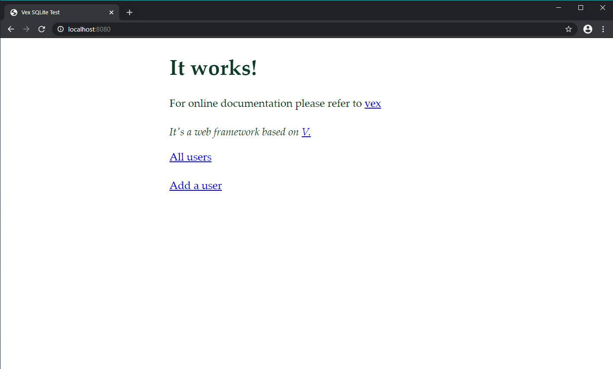

# Vex
Easy-to-use, modular web framework for V.

> Vex is still in its early stages and some of the parts were not implemented yet.



```v
module main

import vex.server // or nedpals.vex.server
import vex.ctx // or nedpals.vex.ctx

fn main() {
    mut s := server.new()
    s.get('/', fn (req ctx.Req, res mut ctx.Resp) {
        res.send_file('index.html', 200)
    })
    
    s.get('/public/*path', fn (req ctx.Req, res mut ctx.Resp) {
        res.send_file('public/' + req.params['path'], 200)
    })

    s.get('/path/:name', fn (req ctx.Req, res mut ctx.Resp) {
        res.send('path: ' + req.params['name'], 200)
    })

    s.get('/complex/:name/*path', fn (req ctx.Req, res mut ctx.Resp) {
        res.send('username: ' + req.params['name'] + '\npath: ' + req.params['path'], 200)
    })

    s.use(fn (req mut ctx.Req, res mut ctx.Resp) {
        println('request: ${req.time.unix}')
        println('response: ${res.time.unix}')

        println('${req.path}')
    })

    s.serve(6789)
}
```

## Static File Server
Vex 0.2 removes the built-in static file server support (`serve_static` function) in favor of creating custom routes for serving static assets. You can use the code below to implement the similar functionality as the previous one.

```v

fn main() {
    // ...
    s.get('/public/*path', fn (req ctx.Req, res mut ctx.Resp) {
        res.send_file('public/' + req.params['path'], 200)
    })
    // ...
}
```

## Simplified Middleware API
Middlewares tend to be used for any security-related purposes as well as for logging requests. With that in mind, Vex 0.2 has removed certain features (include/exclude routes, triggering location) in favor of a more simple middleware system which is triggered right before passing it to the matched routing handlers.

```v
// old
fn log_server_old(req vex.Req, res vex.Resp) {
    println('${req.path}')
}

// new
fn log_server(req mut ctx.Req, res mut ctx.Resp) {
    println('request: ${req.time.unix}')
    println('response: ${res.time.unix}')

    println('${req.path}')
}

fn main() {
    // ...
    s.connect(log_server_old, ['*']) // old
    s.use(log_server) // new
    // ...
}
```

## Dependencies
~~Vex uses v-mime to identify MIME types when serving files.~~
Vex now stores a fork of [v-mime](https://github.com/nedpals/v-mime) to avoid errors when using it in subdirectories.

## Roadmap
- [X] Support for `GET`, `POST`, `PUT`, `PATCH`, `DELETE`, and `OPTION` HTTP methods.
- [x] HTTP Router (Wildcards are now supported)
- [x] ~~Static file server~~
- [x] Params and query parsing
- [x] Body parsing (supports raw text for now)
- [x] Middleware support
- [x] Cookie parsing (basic support)
- [ ] Form data parsing
  - [x] `application/x-www-form-urlencoded` support
  - [ ] `multipart/form-data` support

## Contributing
1. Fork it (<https://github.com/nedpals/vex/fork>)
2. Create your feature branch (`git checkout -b my-new-feature`)
3. Commit your changes (`git commit -am 'Add some feature'`)
4. Push to the branch (`git push origin my-new-feature`)
5. Create a new Pull Req

## Examples
Examples can be found at the [`/examples`](/examples) directory.

## License
[MIT](LICENSE)

## Contributors

- [Ned Palacios](https://github.com/nedpals) - creator and maintainer